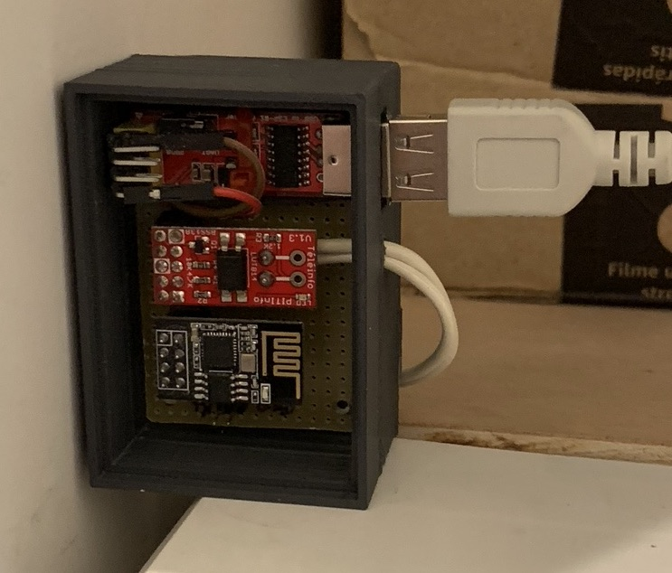

# WifInfo

WifInfo est un module de consignation de la téléinformation des compteurs électriques avec serveur web embarqué.

Ce projet est la fusion de développements réalisés en vue du remplacement d'un [eco-devices](http://gce-electronics.com/fr/111-eco-devices) sur base de [ESP-01](https://fr.wikipedia.org/wiki/ESP8266) et de la une réécriture quasi complète - sauf la partie interface web - du projet homonyme de C-H. Hallard [LibTeleinfo](https://github.com/hallard/LibTeleinfo) avec des modifications notamment de [olileger](https://github.com/olileger/LibTeleinfo) et [Doume](https://github.com/Doume/LibTeleinfo).

* Meilleure séparation des fonctions dans des fichiers sources différents
* Homogénéisation du nommage, nettoyage du code source
* Minimisation des allocations mémoire (nouvelle librairie teleinfo)
* Server-sent event ([SSE](https://fr.wikipedia.org/wiki/Server-sent_events)) pour les mises à jour des index
* Notifications HTTP sur changements HC/HP et dépasssement de seuils ou ADPS
* Client en liaison série pour mise au point avec [SimpleCLI](https://github.com/spacehuhn/SimpleCLI)
* Tests sur PC avec [Google Test](https://github.com/google/googletest) et couverture avec [lcov](http://ltp.sourceforge.net/coverage/lcov.php)
* Client Python de simulation [cli.py](./cli.py) sur base de `miniterm.py` de [pySerial](https://pyserial.readthedocs.io/)
* Compression et minimisation de la partie web avant écriture du filesystem (`data_src` ⇒ `data` au moment du build)
* Serveur Python [Flask](https://www.palletsprojects.com/p/flask/) pour développement de la partie web
* Utilisation de [PlatformIO](https://platformio.org) comme environnement de développement

## Documentation

Documentation ERDF sur la [téléinformation client](https://www.enedis.fr/sites/default/files/Enedis-NOI-CPT_02E.pdf) pour les compteurs électroniques et pour les compteurs [Linky](https://www.enedis.fr/sites/default/files/Enedis-NOI-CPT_54E.pdf).

Module [PiTInfo](https://hallard.me/pitinfov12/) et explications pourquoi le montage avec uniquement optocoupleur et résistances ne suffit pas avec un esp8266.

## Compilation

Le projet est prévu pour PlatformIO sous macOS ou Linux, en conjonction avec [Visual Studio Code](https://code.visualstudio.com) et son l'extension [PlatformIO](https://marketplace.visualstudio.com/items?itemName=platformio.platformio-ide).
L'IDE d'Arduino peut également être utilisé.

La page HTML est compressée avec [html-minifier](https://github.com/kangax/html-minifier) et gzip.

### PlatformtIO

```bash
platformio run -t uploadfs
platformio run -t upload
```

### IDE Arduino

Cf. les nombreux tutos pour l'utilisation d'esp8266-arduino et l'upload de spiffs.

Le répertoire `data` est préparé à l'aide du script suivant (nécessite python3, gzip, html-minifier) :

```bash
python3 prep_data_folder.py
```

## Client de test/mise au point

```bash
pip3 install pySerial
python3 cli.py [port]
```

Pour activer le mode commande, il faut taper <TAB> puis la commande (ls, config, time, esp, ...).

* `Ctrl-T` envoie une trame de téléinformation
* `Ctrl-Y` bascule l'envoi automatique de trames
* `Ctrl-P` bascule entre heures creuses et heures pleines
* `Ctrl-C` sort du client

## Tests unitaires

Les tests unitaires et la couverture sont faites dans un conteneur Docker.

Néanmoins, les logiciels et librairies suivants sont nécessaires:
* [CMake](https://cmake.org)
* [Google Test](https://github.com/google/googletest)
* [nlohmann json](https://github.com/nlohmann/json)
* [lcov](http://ltp.sourceforge.net/coverage/lcov.php)

Préparation de l'image:
```bash
docker build -t tic .
```

Lancement des tests et couverture:
```bash
docker run --rm -ti -v $(pwd):/tic:ro -v $(pwd)/coverage:/coverage tic /tic/runtest.sh
```

La couverture est disponible dans `./coverage/index.html`


## Développement web

### Avec module simulé (aucun esp8266 requis)

```bash
pip3 install flask flask_cors
python3 tools/srv.py
```
L'interface est alors disponible à cette adresse: [http://localhost:5000/](http://localhost:5000/).

### Avec module et partie web sur PC

[nginx](http://nginx.org/en/) est utilisé en reverse proxy pour accéder aux pages dynamiques du module.

```bash
tools/httpdev.sh [adresse IP du module]
```
L'interface alors sera disponible à cette adresse: [http://localhost:5001/](http://localhost:5001/), avec les requêtes dynamiques redirigées vers le module (qui doit donc être opérationnel et joignable).

## Montage

Le montage final utilise un ESP-01S avec le module [PiTInfo](http://hallard.me/pitinfov12-light/) - à acheter sur [tindie](https://www.tindie.com/products/Hallard/pitinfo/). L'alimentation est assurée par module USB.



## Licence

Compte-tenu de la diversité d'origine des sources, ce travail est publié avec la licence de [WifInfo](https://github.com/hallard/LibTeleinfo/tree/master/examples/Wifinfo).

<div align="center">

[](http://creativecommons.org/licenses/by-nc-sa/4.0/)

</div>

Ce(tte) œuvre est mise à disposition selon les termes de la [Licence Creative Commons Attribution - Pas d’Utilisation Commerciale - Partage dans les Mêmes Conditions 4.0 International](http://creativecommons.org/licenses/by-nc-sa/4.0/).
