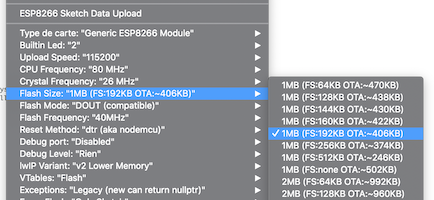
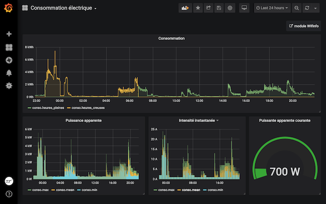

# WifInfo

[](https://github.com/rene-d/wifinfo/actions?query=workflow%3A%22PlatformIO+CI%22)
[](https://github.com/rene-d/wifinfo/actions?query=workflow%3A%22Unit+tests%22)
[](https://www.codacy.com/manual/rene-d/wifinfo?utm_source=github.com&amp;utm_medium=referral&amp;utm_content=rene-d/wifinfo&amp;utm_campaign=Badge_Grade)
[](https://codecov.io/gh/rene-d/wifinfo)
[](https://creativecommons.org/licenses/by-nc-sa/4.0/)
[](https://github.com/rene-d/wifinfo/releases)

WifInfo est un module de consignation de la téléinformation des compteurs électriques 🇫🇷 avec serveur web embarqué.

## Introduction

Ce projet est la fusion de développements réalisés en vue du remplacement d'un [eco-devices](http://gce-electronics.com/fr/111-eco-devices) sur base de [Espressif 8266EX](https://fr.wikipedia.org/wiki/ESP8266) et de la une réécriture quasi complète - sauf la partie interface web - du projet homonyme de [C-H. Hallard](http://hallard.me) [LibTeleinfo](https://github.com/hallard/LibTeleinfo) avec des modifications notamment de [olileger](https://github.com/olileger/LibTeleinfo) et [Doume](https://github.com/Doume/LibTeleinfo).

-   Meilleure séparation des fonctions dans des fichiers sources différents
-   Homogénéisation du nommage, nettoyage du code source
-   Minimisation des allocations mémoire (nouvelle librairie teleinfo)
-   Server-sent event ([SSE](https://fr.wikipedia.org/wiki/Server-sent_events)) pour les mises à jour des index
-   Notifications HTTP sur changements HC/HP et dépasssement de seuils ou ADPS
-   Compression et minimisation de la partie web avant écriture du filesystem (`data_src` ⇒ `data` au moment du build)
-   Client en liaison série pour mise au point avec [SimpleCLI](https://github.com/spacehuhn/SimpleCLI)
-   Tests unitaires sur PC et couverture
-   Analyse statique de code
-   Client Python de simulation [cli.py](tools/cli.py) sur base de `miniterm.py` de [pyserial](https://pyserial.readthedocs.io/)
-   Serveur Python [Flask](https://www.palletsprojects.com/p/flask/) pour développement de la partie web
-   Exemple de stack [InfluxDB](https://www.influxdata.com) + [Grafana](https://grafana.com) pour la visualisation des données (avec sonde Python et client SSE)
-   Utilisation de [PlatformIO](https://platformio.org) comme environnement de développement

 Adaptation a une version TEMPO, et platformio sur Windows
 Gestion d'une platform 2CH Relay type https://www.hagensieker.com/wordpress/2019/02/21/hacking-unknown-2-channel-relay-with-tasmota/
 gestion des deux relays simpliste pour reprendre la configuration des contacts C1C2 C3C4 des compteurs Electronique historique.
 le C3C4 ayant disparu des compteurs Linky.

Les notifications jeedom/emoncms ne sont pas testées.
mise en compilation conditionnelle de jeedom et emoncms.

## Références

Documentation Enedis sur la [téléinformation client](https://www.enedis.fr/sites/default/files/Enedis-NOI-CPT_02E.pdf) pour les compteurs électroniques et pour les compteurs [Linky](https://www.enedis.fr/sites/default/files/Enedis-NOI-CPT_54E.pdf).

Module [PiTInfo](https://hallard.me/pitinfov12/) et explications pourquoi le montage avec uniquement optocoupleur et résistances ne suffit pas avec un esp8266.

## Interface web

### Affichage des jauges PAPP, IINST et index HC/HP (en temps réel)


### Affichage de données de téléinformation


### Configuration des requêtes HTTP

Les requêtes HTTP sont de type GET.

Il y a 4 déclenchements possibles:

-   périodique
-   lors d'un changement de période tarifaire (exemple passage de HP à HC)
-   lors de dépassement d'un seuil haut ou retour à un seuil bas (en VA, test avec la valeur PAPP)
-   présence de l'étiquette ADPS (Avertissement de Dépassement de Puissance Souscrite)

L'URI est constituée avec les étiquettes de téléinformation (`ADCO`, `HCHC`, `HCHP`, `PTEC`, `PAPP`, `IINST`, etc.) ainsi que des étiquettes internes:

-   date : date au format ISO8601 (ex: 2020-02-02T12:12:00+0100)
-   timestamp : temps en secondes (Unix epoch)
-   chipid : l'identifiant de l'esp8266 sous forme hexadécimale (0x0011AA)
-   type : type de déclenchement (`MAJ`: périodique, `PTEC`: changement tarif, `HAUT`: seuil haut, `BAS`: retour seuil bas, `ADPS`: dépassement, `NORM`: fin dépassement)

La syntaxe pour utiliser les étiquettes est au choix:

-   `$NOM`
-   `~NOM~`

Exemple: `/update.php?ptec=$PTEC&conso=~HCHC~+~HCHP~&id=$chipid` ⇒ `/update.php?ptec=HP&conso=4000+3000&id=0x0011AA`

### Données JSON

-   <http://wifinfo/json> : téléinformation sous forme de dictionnaire JSON
-   <http://wifinfo/tinfo.json> : téléinformation sous forme de tableau JSON, utilisé par l'onglet Téléinformation de l'interface
-   <http://wifinfo/system.json> : état du système, utilisé par l'onglet Système de l'interface
-   <http://wifinfo/config.json> : état du système, utilisé par l'onglet Configuration de l'interface
-   <http://wifinfo/wifiscan.json> : liste des réseaux Wi-Fi, utilisé par l'onglet Configuration de l'interface
-   <http://wifinfo/relays.json> : gestion des relais;
-   <http://wifinfo/switch">: etat et modification des relays 

### Autres requêtes

-   <http://wifinfo/reset> : permet de redémarrer le module
-   <http://wifinfo/version> : retourne la version (tag git) du système de fichiers

### Notifications SSE

Les événements SSE sont accessibles via deux URL: <http://wifinfo/tic> ou <http://wifinfo/sse/json>, avec une limitiation à deux clients simultatnés.

La donnée est la trame de téléinformation au format JSON, comme <http://wifinfo/json>.

Elle est envoyée à chaque réception de trame depuis le compteur.

## Installation

**Depuis la version 1.6, le projet utilise un autre système de fichiers que SPIFFS (code trop gourmand ~30Ko, et rajoute beaucoup d'overhead dans le filesystem). Les tailles du firmware et du filesystem empêchaient les mises à jour des modules avec 1Mo de mémoire flash.**

Le projet automatiquement est compilé  pour deux boards (_Releases_):
-   [esp01_1m](https://docs.platformio.org/en/latest/boards/espressif8266/esp01_1m.html) : ESP-01S avec 1 Mo de mémoire flash et LED sur GPIO2, dont 192 Ko pour le filesystem ERFS
-   [esp12e](https://docs.platformio.org/en/latest/boards/espressif8266/esp12e.html) : ESP-12E (type NodeMCU 1.0) ou ESP-07 avec 4 Mo de flash, dont 1 Mo pour le filesystem ERFS

La programmation d'un module requiert des outils. [esptool.py](https://github.com/espressif/esptool) est l'outil officiel. L'IDE [Arduino](https://www.arduino.cc/en/main/software) permet également de le faire.

Veuillez noter que chaque firmware est compilé pour une board précise, avec un plan d'adressage et une taille mémoire précises. Pour téléverser le programme avec l'IDE Arduino, il faut veiller à choisir la bonne carte et la bonne "Flash Size".

Programmation module 1 Mo :
```bash
esptool.py write_flash 0 firmware.bin
esptool.py write_flash 0xcb000 erfs.bin
```

Programmation module 4 Mo :
```bash
esptool.py write_flash 0 firmware.bin
esptool.py write_flash 0x300000 erfs.bin
```

## Compilation

Le projet est conçu pour PlatformIO, en conjonction avec [Visual Studio Code](https://code.visualstudio.com) et son extension [PlatformIO](https://marketplace.visualstudio.com/items?itemName=platformio.platformio-ide).

L'IDE d'Arduino peut également être utilisé.

La page HTML est compressée avec [html-minifier](https://github.com/kangax/html-minifier) et gzip.

### Options de compilation

-   `ENABLE_DEBUG` : active la sortie sur le port série TX et vitesse 115200. Non utilisable avec un compteur, il faut utiliser le client de test pour injecter des trames.
-   `ENABLE_CLI` : active les commandes par port série (`TAB` ou `ESC`)
-   `ENABLE_LED` : active l'utilisation de LED pour les cartes qui en ont une (esp01s, esp12e)
-   `ENABLE_OTA` : rajoute le code pour les mises à jour OTA **(non testé)**
-   `ENABLE_CPULOAD` : mesure de manière empirique la charge CPU
-   `WIFINFO_FS` : filesystem à utiliser (SPIFFS ou ERFS)

Nota: Sans l'option `ENABLE_DEBUG`, le port série est réglé à 1200 7E1 en RX uniquement. Il y a suffisamment d'outils de mise au point pour ne pas à devoir tester avec un compteur ou un autre microcontrôleur qui simule la téléinformation.

### Génération du filesystem ERFS

Le filesystem est automatiquement construit par PlatformIO - même s'il s'appelle `spiffs.bin`, PlatformIO ne permet pas d'en changer le nom.

Les différentes étapes peuvent être reproduites indépendamment.

Le répertoire `data` est préparé à l'aide du script [prep_data_folder.py](./prep_data_folder.py) (nécessite python3, gzip, html-minifier) :

```bash
python3 prep_data_folder.py
```

Le fichier binaire est assemblé par le script [mkerfs32.py](./mkerfs32.py) est l'outil utilisé.

```bash
# version 1Mo flash dont 192Ko de filesystem
python3 mkerfs32.py -c data -s 192k erfs.bin

# version 4Mo flash dont 1Mo de filesystem
python3 mkerfs32.py -c data -s 1000k erfs.bin
```

### PlatformtIO

Avec PlatformIO (soit ligne de commandes, soit extension Visual Studio Code):

```bash
platformio run -e <carte> -t uploadfs
platformio run -e <carte> -t upload
```

Cf. [platformio.ini](./platformio.ini) pour l'environnement `<carte>`.

### IDE Arduino

Cf. les nombreux tutos pour l'utilisation d'esp8266-arduino. Il sera aussi nécessaire de rajouter la librairie SimpleCLI.

Le script [mkarduinosrc.py](tools/mkarduinosrc.py) permet l'[amalgamation](https://www.sqlite.org/amalgamation.html) du code source en un seul `wifinfo.ino`.

Ajout [SimpleCLI](https://github.com/spacehuhn/SimpleCLI):


Sélection de `Flash Size` pour module 1 Mo:



## Client de test/mise au point

[cli.py](tools/cli.py) est un terminal série qui permet d'injecter de la téléinformation

```bash
pip3 install pyserial click
./cli.py
```

Pour activer le mode commande (si compilé avec l'option `ENABLE_CLI`), il faut taper <TAB> ou <ESC> puis la commande (ls, config, time, esp, ...).

-   `Ctrl-T` envoie une trame de téléinformation
-   `Ctrl-Y` bascule l'envoi automatique de trames
-   `Ctrl-P` bascule entre heures creuses et heures pleines
-   `Ctrl-C` sort du client

[sse.py](tools/sse.py) est un client SSE. Lorsque WifInfo a un client connecté, il envoie toutes les trames reçues du compteur sur cette socket.

```bash
pip3 install sseclient click
./sse.py
```

## Tests et couverture

Sans Docker:

```bash
mkdir -p build && cd build
cmake .. -DCODE_COVERAGE=ON -DCMAKE_BUILD_TYPE=Debug -G Ninja
ninja
ninja test
```

Ou plus simplement:

```bash
./runtest.sh
```

L'installation de certains outils et librairies est nécessaire.

Avec Docker (tout est packagé dans l'image Docker):

```bash
docker build -t tic .
docker run --rm -ti -v $(pwd):/tic:ro -v $(pwd)/coverage:/coverage tic /tic/runtest.sh
```

La couverture est disponible dans `./coverage/index.html`.

## Développement de l'interface HTML

### Avec module simulé (aucun esp8266 requis)

```bash
pip3 install flask flask-cors
python3 tools/srv.py
```

L'interface est alors disponible à cette adresse: <http://localhost:5000/>.

### Avec module et partie web sur PC

[nginx](http://nginx.org/en/) est utilisé en reverse proxy pour accéder aux pages dynamiques du module.

```bash
tools/httpdev.sh [adresse IP du module]
```

L'interface alors sera disponible à cette adresse: <http://localhost:5001/>, avec les requêtes dynamiques redirigées vers le module (qui doit donc être opérationnel et joignable).

## Dashboard Grafana

La mise en place d'une stack sonde/InfluxDB/Grafana est grandement simplifiée grâce à Docker.

Le fichier [docker-compose.yaml](tools/dashboard/docker-compose.yaml) rassemble les trois services:

-   la sonde, écrite en Python, qui récupère les données en JSON via une connexion SSE avec le module
-   la base de données InfluxDB de type TSBD
-   Grafana pour la visulation des données

Il faudra configurer dans Grafana la source de données (<http://influxdb:8086>) et la database (teleinfo).

Le dashboard donné en exemple est celui créé par [Antoine Emerit](https://www.kozodo.com/blog/techno/article.php?id=32) et légèrement modifié (calcul du coût dans le dashboard plutôt que dans la database).

On peut en créer facilement selon ses propres besoins ou envies.

```bash
WIFINFO=<adresse IP du module> docker-compose up -d
```

Le dashboard sera alors accessible à cette adresse: <http://localhost:3000/>.



## Montage

Le montage final utilise un ESP-01S avec le module [PiTInfo](http://hallard.me/pitinfov12-light/) - à acheter sur [tindie](https://www.tindie.com/products/Hallard/pitinfo/). L'alimentation est assurée par un module USB.


## Technologies utilisées

### Développement

-   [Visual Studio Code](https://code.visualstudio.com)
-   [PlatformIO](https://platformio.org)
-   [PlatformIO IDE](https://marketplace.visualstudio.com/items?itemName=platformio.platformio-ide)
-   [Node.js](https://nodejs.org/en/)
-   [html-minifier](https://github.com/kangax/html-minifier) : Javascript-based HTML compressor/minifier

### Tests unitaires & couverture

-   [Docker](https://www.docker.com) ou [Docker Desktop](https://www.docker.com/products/docker-desktop)
-   [CMake](https://cmake.org)
-   [Ninja](https://ninja-build.org)
-   [Google Test](https://github.com/google/googletest) : Google Testing and Mocking Framework
-   [nlohmann json](https://github.com/nlohmann/json) : JSON for Modern C++
-   [gcovr](https://gcovr.com/) : Generate C/C++ code coverage reports with gcov
-   [gtest2html](https://github.com/adarmalik/gtest2html) : Convert googletest xml output to html

### QA & CI/CD

-   [git](https://git-scm.com) : free and open source distributed version control system
-   [cppcheck](http://cppcheck.net) : static analysis tool for C/C++ code
-   [clang-tidy](https://clang.llvm.org/extra/clang-tidy/) : clang-based C++ “linter” tool
-   [GitHub Actions](https://github.com/features/actions) : workflow automation for GitHub
-   [Codacy](https://www.codacy.com) : Automated code reviews & code analytics
-   [Codecov](https://codecov.io) : Tools to group, merge, archive, and compare coverage reports.

### Client de test/injecteur de téléinfo

-   [Python3.6+](https://www.python.org)
-   [pyserial](https://pypi.org/project/pyserial/) : Python Serial Port Extension

### Développement web

-   [Python3.6+](https://www.python.org)
-   [Flask](https://pypi.org/project/Flask/) : A simple framework for building complex web applications.
-   [Flask-Cors](https://pypi.org/project/Flask-Cors/) : A Flask extension adding a decorator for CORS support

### Développement web/vrai module

-   [Docker](https://www.docker.com) ou [Docker Desktop](https://www.docker.com/products/docker-desktop)
-   [nginx](http://nginx.org) dans un [conteneur](https://hub.docker.com/_/nginx)

### Client SSE

-   [Python3.6+](https://www.python.org)
-   [sseclient](https://pypi.org/project/sseclient/) : Python client library for reading Server Sent Event streams.
-   [click](https://pypi.org/project/click/) : Composable command line interface toolkit

### Dashboard Grafana+InfluxDB

-   [Docker](https://www.docker.com) ou [Docker Desktop](https://www.docker.com/products/docker-desktop)
-   [Docker Compose](https://docs.docker.com/compose/)
-   [Grafana](https://grafana.com) dans un [conteneur](https://hub.docker.com/r/grafana/grafana) Docker
-   [InfluxDB](https://www.influxdata.com) dans un [conteneur](https://hub.docker.com/_/influxdb) Docker
-   sonde Python
    -   Python3 dans un [conteneur](https://hub.docker.com/_/python) Docker
    -   [sseclient](https://pypi.org/project/sseclient/) : Python client library for reading Server Sent Event streams.
    -   [click](https://pypi.org/project/click/) : Composable command line interface toolkit
    -   [influxdb](https://pypi.org/project/influxdb/) : InfluxDB client

## Licence

Compte-tenu de la diversité d'origine des sources, ce travail est publié avec la licence de [WifInfo](https://github.com/hallard/LibTeleinfo/tree/master/examples/Wifinfo) sauf mention contraire.

[](http://creativecommons.org/licenses/by-nc-sa/4.0/)

Ce(tte) œuvre est mise à disposition selon les termes de la [Licence Creative Commons Attribution - Pas d’Utilisation Commerciale - Partage dans les Mêmes Conditions 4.0 International](http://creativecommons.org/licenses/by-nc-sa/4.0/).

This work is licensed under a [Creative Commons Attribution-NonCommercial-ShareAlike 4.0 International License](http://creativecommons.org/licenses/by-nc-sa/4.0/).

SPDX-License-Identifier: CC-BY-NC-SA-4.0
